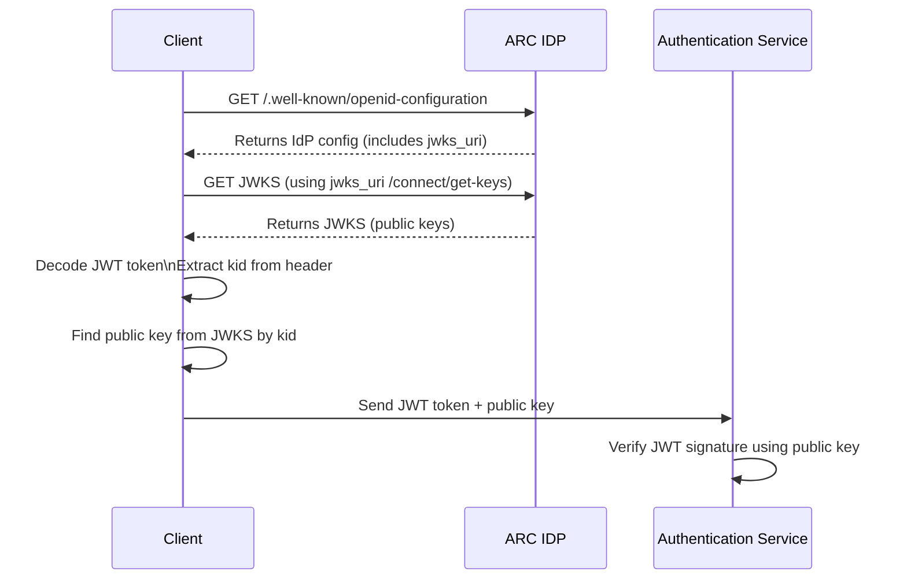

<a style="position: relative; top: 10px;" href="https://sourcefuse.github.io/arc-docs/arc-api-docs" target="_blank"></a>

# [@sourceloop/authentication-service](https://github.com/sourcefuse/loopback4-microservice-catalog/tree/master/services/authentication-service)

<p align="left">
<a href="https://www.npmjs.org/package/@sourceloop/authentication-service">

</a>
<a href="https://github.com/sourcefuse/loopback4-microservice-catalog/graphs/contributors" target="_blank">

</a>
<a href="https://www.npmjs.com/@sourceloop/authentication-service" target="_blank">

</a>
<a href="./LICENSE">

</a>
<a href="https://loopback.io/" target="_blank">

</a>
</p>

## Overview

A Microservice for handling authentications. It provides -

- Multi-Tenant support, you can see the database schema [here](#database-schema).
- External Identity Provider integration.
- Ability to issue [JWT](https://jwt.io/) tokens using [jsonwebtoken](https://www.npmjs.com/package/jsonwebtoken).
- Authenticate JWT tokens using [passport-http-bearer](http://www.passportjs.org/packages/passport-http-bearer/).
- Local Signup using a signup token.
- Forgot/Reset/Change password.
- Google OAuth using [passport-google-oauth](http://www.passportjs.org/docs/google/).
- Keycloak OAuth using [passport-keycloak-bearer](https://www.npmjs.com/package/passport-keycloak-bearer).
- Instagram OAuth using [passport-instagram](http://www.passportjs.org/packages/passport-instagram/).
- Facebook OAuth using [passport-facebook](http://www.passportjs.org/packages/passport-facebook/).
- Apple OAuth using [passport-apple](https://www.npmjs.com/package/passport-apple).
- Cognito OAuth using [passport-cognito-oauth2](https://www.npmjs.com/package/passport-cognito-oauth2).
- SAML Authentication using [@node-saml/passport-saml](https://www.npmjs.com/package/passport-saml).
- OTP Auth using custom passport otp strategy.
- Two-Factor Authentication.
- Maintain daily active users.

To get started with a basic implementation of this service, see `/sandbox/auth-basic-example`.

For a more elaborate and custom implementation that overrides the default models and repositories, see `/sandbox/auth-multitenant-example`.

### Working and Flow

This module uses the decorators provided by [loopback4-authentication](https://www.npmjs.com/package/loopback4-authentication) and [loopback4-authorization](https://www.npmjs.com/package/loopback4-authorization). For reference, below is the flow for the login code generation that uses the authenticate client, authenticate user and authorization decorators from these npm packages -


#### Maintaining the activity of the users

Whenever a user logins in to the system we make an entry in the login_activity table marking the users login time and his details. The login type can be "ACCESS","RELOGIN","LOGOUT" based on the action taken by the user. This way a track can be maintained. Api to fetch daily/monthly active users is available that gives a list of active users for the provided date range based on users selection.
The actor field is configurable. The dafault value is user.id but can be changed by binding the appropriate field to `AuthServiceBindings.ActorIdKey`.

```typescript
this.application.bind(AuthServiceBindings.ActorIdKey).to('id');
```

### Installation

```bash

npm i @sourceloop/authentication-service

```

### Usage

- Create a new Loopback4 Application (If you don't have one already)
  `lb4 testapp`
- Install the authentication service
  `npm i @sourceloop/authentication-service`
- Set the [environment variables](#environment-variables).
- Run the [migrations](#migrations).
- Add the `AuthenticationServiceComponent` to your Loopback4 Application (in `application.ts`).
  ```typescript
  // import the AuthenticationServiceComponent
  import {AuthenticationServiceComponent} from '@sourceloop/authentication-service';
  // add Component for AuthenticationService
  this.component(AuthenticationServiceComponent);
  ```
- Set up a [Loopback4 Datasource](https://loopback.io/doc/en/lb4/DataSource.html) with `dataSourceName` property set to
  `AuthDbSourceName`. You can see an example datasource [here](#setting-up-a-datasource).
- Set up a Loopback4 Datasource for caching tokens with `dataSourceName` property set to `AuthCacheSourceName`.
- Bind any of the custom [providers](#providers) you need.
- **OTP** -
  - Implement OtpSenderProvider(refer [this](./src/providers/otp-sender.provider.ts)) in your application and bind it to its respective key in application.ts
  ```typescript
  import {
    VerifyBindings,
    AuthServiceBindings,
  } from '@sourceloop/authentication-service';
  this.bind(VerifyBindings.OTP_SENDER_PROVIDER).toProvider(OtpSenderProvider);
  this.bind(AuthServiceBindings.MfaConfig).to({
    secondFactor: STRATEGY.OTP,
  });
  this.bind(AuthServiceBindings.OtpConfig).to({
    method: OtpMethodType.OTP,
  });
  ```
  - This provider is responsible for sending OTP to user.
  - By default OTP is valid for 5 minutes. To change it, set OTP_STEP and OTP_WINDOW (refer [otp-options](https://www.npmjs.com/package/otplib#totp-options)) as per your need in .env.
- **Google Authenticator** -

  - To use google Authenticator in your application, add following to application.ts

  ```typescript
  import {AuthServiceBindings} from '@sourceloop/authentication-service';
  this.bind(AuthServiceBindings.MfaConfig).to({
    secondFactor: STRATEGY.OTP,
  });
  this.bind(AuthServiceBindings.OtpConfig).to({
    method: OtpMethodType.GOOGLE_AUTHENTICATOR,
  });
  ```

- Set APP_NAME in .env.

- To authenticate using only OTP or Authenticator app, use the following APIs:

  - `/send-otp`
  - `/auth/check-qr-code`
  - `/auth/create-qr-code`
  - `/verify-otp`

- **Two-Factor-Authentication** -

  - As of now, 2nd Factor will always be either OTP or Google Authenticator.
  - Implement MfaProvider(refer [this](./src/providers/mfa.provider.ts)) in your application setting
    its value to true and bind it to its respective key in application.ts

    ```typescript
    import {VerifyBindings} from '@sourceloop/authentication-service';
    this.bind(VerifyBindings.MFA_PROVIDER).toProvider(MfaProvider);
    ```

  - It works for almost all authentication methods provided by this service.
  - Use `/verify-otp` to enter otp or code from authenticator app.
    for using Google Authenticator user needs to pass client id in the payload which is optional in case for OTP

- **Oauth- using Cognito** -
  - Make sure your AWS Cognito setup is properly configured. You can refer to the official documentation [here](https://docs.aws.amazon.com/cognito/latest/developerguide/authentication.html).
  - Add the following environment variables:

    COGNITO_AUTH_CALLBACK_URL= \
    COGNITO_AUTH_CLIENT_DOMAIN=\
    COGNITO_AUTH_CLIENT_ID=\
    COGNITO_AUTH_CLIENT_SECRET=\
    COGNITO_AUTH_REGION=

    COGNITO_AUTH_CALLBACK_URL should point to the /auth/cognito-auth-redirect endpoint provided by the authentication service.
  - Add NODE_TLS_REJECT_UNAUTHORIZED=0 in environment to disables TLS/SSL certificate validation in Node.js. for ***Development only***.
  - We are using the loopback4-authentication package in the backend service. The User, AuthClient, and UserCredential models, along with the /auth/cognito and /auth/cognito-auth-redirect APIs, have been set up in the authentication service. You only need to bind the required providers as described in the [loopback4-authentication](https://github.com/sourcefuse/loopback4-authentication)
  - When the application is redirected back with the authorization code generated by the callback API, the application can send this code to the /auth/token endpoint to obtain the access token for your application.
  - Create an auth_client entry in your database using the query below:
  
    ```typescript
    INSERT INTO auth_clients (client_id, client_secret, secret)
    VALUES ('temp_client', 'temp_secret', 'secret');
    ```
    Use the client_id and client_secret to invoke the auth/cognito API from the frontend.
  - Additionally, configure the redirect_url for this auth client to point to the frontend URL where you want the user to be redirected after successful authorization from Cognito. The user will be redirected to this URL with a code query parameter, which can then be exchanged for a token using the /auth/token endpoint.
  - The OAuth endpoints are meant to be accessed from a web browser, not from API testing tools. The API explorer shows you
  the endpoint structure, but you must test OAuth flows through:
    - Your frontend application
    - A real browser session
    - Tools specifically designed for OAuth testing (like Postman with proper OAuth 2.0 support)

    Kindly create a Dummy web App to hit and manage the apis.

- **OAuth- using Azure AD** -

  - Passport strategy for authenticating via Azure Ad using [passport-azure-ad](https://www.npmjs.com/package/passport-azure-ad).
    Make sure you have an account on Azure and have your application registered. Follow the steps [here](https://docs.microsoft.com/en-us/azure/active-directory-b2c/configure-a-sample-node-web-app).
  - Refer the .env.example file to add all the relevant env variables for Azure Auth. Note - For boolean values that need to passed as false keep them blank.
    We are using cookie based approach instead of session based, so the library requires a cookie-parser middleware. To bind the middleware to you application set AZURE_AUTH_ENABLED=true in env file so the middleware will be added to the sequence.
    Also the verifier function uses Signup provider whose implementation needs to be added by the user.
    Bind the provider key to its corresponding value.

    ```ts
    this.providers[SignUpBindings.AZURE_AD_SIGN_UP_PROVIDER.key] =
      AzureAdSignupProvider;
    ```

    ```ts
    export class AzureAdSignupProvider implements Provider<AzureAdSignUpFn> {
      value(): AzureAdSignUpFn {
        // sonarignore:start
        return async profile => {
          // sonarignore:end
          throw new HttpErrors.NotImplemented(
            `AzureAdSignupProvider not implemented`,
          );
        };
      }
    }
    ```

    Also bind `VerifyBindings.AZURE_AD_PRE_VERIFY_PROVIDER` and `VerifyBindings.AZURE_AD_POST_VERIFY_PROVIDER` to override the basic implementation provided by [default](https://github.com/sourcefuse/loopback4-microservice-catalog/tree/master/services/authentication-service/src/providers).

- **Authorizing Public & Private Clients**

  - In order to authorize public and private clients separately in your application, add the following to application.ts before binding AuthenticationComponent

    ```typescript
    import { AuthenticationBindings, AuthenticationConfig} from 'loopback4-authentication';
    this.bind(AuthenticationBindings.CONFIG).to({
    secureClient: true,
    } as Authentication Config);
    ```

  - Authorizing Public & Private Clients-Migrations :

    add client_type column to auth_clients table with values public/private

    ```sql
    ALTER TABLE main.auth_clients
    ADD client_type varchar(100) DEFAULT 'public';
    ```

    For a more elaborate implementation , see `/sandbox/auth-public-private-client`.

- **Authenticating JWT using RSA Encryption**

  To generate the keys, we have exposed an endpoint through which both keys can be generated.

  Endpoint:- {AUTH_SERVICE_URL}/connect/generate-keys

  It will generate the “N” number of keys in the database, where N = process.env.MAX_JWT_KEYS. You need to set another env variable named "process.env.JWT_PRIVATE_KEY_PASSPHRASE", which will be used to encrypt/decrypt private key.

  By default we are employing asymmetric token signing and verification, but if symmetric signing and verification is required it has to be explicitly provided in the manner below

  ```ts
  this.bind(AuthServiceBindings.Config).to({
    useSymmetricEncryption: true,
  });
  ```

- **Authenticating Password using RSA Encryption**

  In order to authenticate password using RSA encrytion we need to provide private key through an env variable called `PRIVATE_DECRYPTION_KEY`.
  By employing RSA encryption and the private key through the environment variable, this approach enhances the security of password authentication, ensuring that passwords are transmitted and stored in an encrypted manner, and can only be deciphered using the designated private key.

  Its implemented through password decryption provider [here](https://github.com/sourcefuse/loopback4-microservice-catalog/blob/master/services/authentication-service/src/providers/password-decryption.provider.ts) which accepts password in encrypted format.It uses node-forge as default for decryption but can be overriden through this password decryption provider for using any other library.

  Note: When using `.env` file put your private key in single line with line breaks escaped with `\n`, one of the ways of doing so can be found [here](https://serverfault.com/questions/466683/can-an-ssl-certificate-be-on-a-single-line-in-a-file-no-line-breaks).

- **JWT keys rotation**

  After the generation, the following endpoint will be created to generate a new key, delete the oldest key, and add the new key to the DB.
  Endpoint:- {AUTH_SERVICE_URL}/connect/rotate-keys

  This api should be called after a configurable time. It can be a cron job or a background task which will call the api to rotate the keys.

  - It will generate a new pair of keys.
  - It will delete the oldest set of keys from the db.
  - It will add the newly generated keys to the db.

- **Using with Sequelize**

  This service supports Sequelize as the underlying ORM using [@loopback/sequelize](https://www.npmjs.com/package/@loopback/sequelize) extension. And in order to use it, you'll need to do following changes.

  - To use Sequelize in your application, add following to application.ts:

  ```ts
  this.bind(AuthServiceBindings.Config).to({
    useCustomSequence: false,
    useSequelize: true,
  });
  ```

  - Use the `SequelizeDataSource` in your audit datasource as the parent class. Refer [this](https://www.npmjs.com/package/@loopback/sequelize#step-1-configure-datasource) for more details.

- **Customizable Password Hashing for Enhanced Security**

  For hashing and verifying of password two providers utilized are as follows:

  PasswordHashingProvider: This provider [here](./src/providers/password-hashing.provider.ts) generates a hash of a given password using bcrypt's hashing function.

  PasswordVerifyProvider: This provider [here](./src/providers//password-verify.provider.ts) verifies whether a plain password matches a hashed password using bcrypt's comparison function

  These providers offer a flexible and modular approach to password hashing and verification within a LoopBack application. Users can easily swap out these implementations with their preferred hashing algorithms by overriding the providers, allowing for customization according to specific security requirements.

- Start the application
  `npm start`

### Using sourceloop/authentication-service as Identity Server

Authenttication service can be used as a identity server. Following endpoints have been exposed for use:-

  <table>
  <thead>
  <th>Endpoint</th>
  <th>HTTP Type</th>
  <th>Description</th>
  </thead>
  <tbody>
    <tr>
      <td>/connect/generate-keys</td>
      <td>POST</td>
      <td>It is generating private and public keys in the jwt-keys table. The number of keys generated will be defined by env variable name MAX_JWT_KEYS</td>
    </tr>
    <tr>
      <td>/.well-known/openid-configuration</td>
      <td>GET</td>
      <td>The discovery endpoint can be used to retrieve metadata about IdentityServer - it returns information like the issuer name, key material, supported scopes, etc</td>
    </tr>
    <tr>
      <td>/connect/get-keys</td>
      <td>GET</td>
      <td>This endpoint will return the public keys available in the database</td>
    </tr>
    <tr>
      <td>/connect/rotate-keys</td>
      <td>POST</td>
      <td>this endpoint will help rotate the keys. It will delete the oldest key and generate a new one</td>
    </tr>
    <tr>
      <td>/connect/userinfo</td>
      <td>GET</td>
      <td>The UserInfo endpoint can be used to retrieve identity information about a subject. It requires a valid access token with at least the ‘openid’ scope.</td>
    </tr>
    <tr>
      <td>/connect/token</td>
      <td>POST</td>
      <td>The token endpoint can be used to programmatically request or refresh tokens (resource owner password credential flow, authorization code flow, client credentials flow, and custom grant types).</td>
    </tr>
    <tr>
      <td>/connect/endsession</td>
      <td>POST</td>
      <td>Redirecting to the logout endpoint clears the authentication session and cookie.</td>
    </tr>
  </tbody>
  </table>

### Environment Variables

<table>
  <thead>
    <th>Name</th>
    <th>Required</th>
    <th>Description</th>
    <th>Default Value</th>
  </thead>
  <tbody>
      <tr>
        <td>NODE_ENV</td>
        <td>Y</td>
        <td>Node environment value, i.e. `dev`, `test`, `prod</td>
        <td></td>
      </tr>
      <tr>
        <td>LOG_LEVEL</td>
        <td>Y</td>
        <td>Log level value, i.e. `error`, `warn`, `info`, `verbose`, `debug`</td>
        <td></td>
      </tr>
      <tr>
        <td>DB_HOST</td>
        <td>Y</td>
        <td>Hostname for the database server.</td>
        <td></td>
      </tr>
      <tr>
        <td>DB_PORT</td>
        <td>Y</td>
        <td>Port for the database server.</td>
        <td></td>
      </tr>
      <tr>
        <td>DB_USER</td>
        <td>Y</td>
        <td>User for the database.</td>
        <td></td>
      </tr>
      <tr>
        <td>DB_PASSWORD</td>
        <td>Y</td>
        <td>Password for the database user.</td>
        <td></td>
      </tr>
      <tr>
        <td>DB_DATABASE</td>
        <td>Y</td>
        <td>Database to connect to on the database server.</td>
        <td></td>
      </tr>
      <tr>
        <td>DB_SCHEMA</td>
        <td>Y</td>
        <td>Database schema used for the data source. In PostgreSQL, this will be `public` unless a schema is made explicitly for the service.</td>
        <td></td>
      </tr>
      <tr>
        <td>REDIS_HOST</td>
        <td>Y</td>
        <td>Hostname of the Redis server.</td>
        <td></td>
      </tr>
      <tr>
        <td>REDIS_PORT</td>
        <td>Y</td>
        <td>Port to connect to the Redis server over.</td>
        <td></td>
      </tr>
      <tr>
        <td>REDIS_URL</td>
        <td>Y</td>
      <td>Fully composed URL for Redis connection. Used instead of other settings if set.</td>
        <td></td>
      </tr>
      <tr>
        <td>REDIS_PASSWORD</td>
        <td>Y</td>
        <td>Password for Redis if authentication is enabled.</td>
        <td></td>
      </tr>
      <tr>
        <td>REDIS_DATABASE</td>
        <td>Y</td>
        <td>Database within Redis to connect to.</td>
        <td></td>
      </tr>
      <tr>
        <td>JWT_SECRET</td>
        <td>Y</td>
        <td>Symmetric signing key of the JWT token.</td>
        <td></td>
      </tr>
      <tr>
        <td>JWT_ISSUER</td>
        <td>Y</td>
        <td>Issuer of the JWT token.</td>
        <td></td>
      </tr>
      <tr>
        <td>JWT_PRIVATE_KEY_PASSPHRASE</td>
        <td>Y</td>
        <td>Passphrase to encrypt/decrypt private key</td>
        <td></td>
      </tr>
      <tr>
        <td>MAX_JWT_KEYS</td>
        <td>Y</td>
        <td>Maximum number of jwt keys generated in the database</td>
        <td></td>
      </tr>
      <tr>
        <td>USER_TEMP_PASSWORD</td>
        <td>N</td>
        <td>Temporary password that can be used during development.</td>
        <td></td>
      </tr>
      <tr>
        <td>GOOGLE_AUTH_URL</td>
        <td>N</td>
        <td>Google OAuth2.0 authorization URL if authentication strategy is set to Google</td>
        <td></td>
      </tr>
      <tr>
        <td>GOOGLE_AUTH_CLIENT_ID</td>
        <td>N</td>
        <td>Google client ID for the service</td>
        <td></td>
      </tr>
      <tr>
        <td>GOOGLE_AUTH_CLIENT_SECRET</td>
        <td>N</td>
        <td>Google client secret for the service</td>
        <td></td>
      </tr>
      <tr>
        <td>GOOGLE_AUTH_TOKEN_URL</td>
        <td>N</td>
        <td>Google OAuth2.0 authorization URL if authentication strategy is set to Google</td>
        <td></td>
      </tr>
      <tr>
        <td>GOOGLE_AUTH_CALLBACK_URL</td>
        <td>N</td>
        <td>Google callback URL for the client configuration in Google</td>
        <td></td>
      </tr>
      <tr>
        <td>FORGOT_PASSWORD_LINK_EXPIRY</td>
        <td>N</td>
        <td>Expiration period of temporary password in seconds. 1800 seconds (30minutes) is the default.</td>
        <td>1800</td>
      </tr>
      <tr>
        <td>KEYCLOAK_HOST</td>
        <td>N</td>
        <td>Hostname of the Keycloak instance. For all keycloak version below 17, user can still use this by only updating the KEYCLOCK_HOST and appending '/auth/realms' to its existing value</td>
        <td></td>
      </tr>
      <tr>
        <td>KEYCLOAK_REALM</td>
        <td>N</td>
        <td>Realm (tenant) in Keycloak</td>
        <td></td>
      </tr>
      <tr>
        <td>KEYCLOAK_CLIENT_ID</td>
        <td>N</td>
        <td>Keycloak client ID for the service</td>
        <td></td>
      </tr>
      <tr>
        <td>KEYCLOAK_CLIENT_SECRET</td>
        <td>N</td>
        <td>Keycloak client secret for the service</td>
        <td></td>
      </tr>
      <tr>
        <td>KEYCLOAK_CALLBACK_URL</td>
        <td>N</td>
        <td>Keycloak callback URL for the client configuration in Google</td>
        <td></td>
      </tr>
      <tr>
        <td>HTTPS_PROXY</td>
        <td>N</td>
        <td>Https proxy url for keycloak auth</td>
        <td></td>
      </tr>

  </tbody>
</table>

Here is the flow diagram to understand how IDP Server works:-



### Setting up a `DataSource`

Here is a sample Implementation `DataSource` implementation using environment variables and PostgreSQL as the data source. The `auth-multitenant-example` utilizes both Redis and PostgreSQL as data sources.

run - ```npm install loopback-connector-postgresql --save```

```typescript
import {inject, lifeCycleObserver, LifeCycleObserver} from '@loopback/core';
import {juggler} from '@loopback/repository';
import {AuthDbSourceName} from '@sourceloop/authentication-service';

const config = {
  name: AuthDbSourceName,
  connector: 'postgresql',
  url: '',
  host: process.env.DB_HOST,
  port: process.env.DB_PORT,
  user: process.env.DB_USER,
  password: process.env.DB_PASSWORD,
  database: process.env.DB_DATABASE,
  schema: process.env.DB_SCHEMA,
};

@lifeCycleObserver('datasource')
export class AuthenticationDbDataSource
  extends juggler.DataSource
  implements LifeCycleObserver
{
  static dataSourceName = AuthDbSourceName;
  static readonly defaultConfig = config;

  constructor(
    // You need to set datasource configuration name as 'datasources.config.Authentication' otherwise you might get Errors
    @inject('datasources.config.authentication', {optional: true})
    dsConfig: object = config,
  ) {
    super(dsConfig);
  }
}
```
redis datasource -
run - ```npm install loopback-connector-kv-redis --save```
```typescript
for redis, datasource example is as below
import {inject, lifeCycleObserver, LifeCycleObserver} from '@loopback/core';
import {AnyObject, juggler} from '@loopback/repository';
import {readFileSync} from 'fs';
import {AuthCacheSourceName} from '@sourceloop/authentication-service';

const config = {
  name: process.env.REDIS_NAME,
  connector: 'kv-redis',
  host: process.env.REDIS_HOST,
  port: process.env.REDIS_PORT,
  password: process.env.REDIS_PASSWORD,
  db: process.env.REDIS_DATABASE,
  url: process.env.REDIS_URL,
  tls:
    +process.env.REDIS_TLS_ENABLED! ||
    (process.env.REDIS_TLS_CERT
      ? {
          ca: readFileSync(process.env.REDIS_TLS_CERT),
        }
      : undefined),
  sentinels:
    +process.env.REDIS_HAS_SENTINELS! && process.env.REDIS_SENTINELS
      ? JSON.parse(process.env.REDIS_SENTINELS)
      : undefined,
  sentinelPassword:
    +process.env.REDIS_HAS_SENTINELS! && process.env.REDIS_SENTINEL_PASSWORD
      ? process.env.REDIS_SENTINEL_PASSWORD
      : undefined,
  role:
    +process.env.REDIS_HAS_SENTINELS! && process.env.REDIS_SENTINEL_ROLE
      ? process.env.REDIS_SENTINEL_ROLE
      : undefined,
};

// Observe application's life cycle to disconnect the datasource when
// application is stopped. This allows the application to be shut down
// gracefully. The `stop()` method is inherited from `juggler.DataSource`.
// Learn more at https://loopback.io/doc/en/lb4/Life-cycle.html
@lifeCycleObserver('datasource')
export class RedisDataSource
  extends juggler.DataSource
  implements LifeCycleObserver
{
  static readonly dataSourceName = AuthCacheSourceName;
  static readonly defaultConfig = config;

  constructor(
    @inject(`datasources.config.${process.env.REDIS_NAME}`, {optional: true})
    dsConfig: AnyObject = config,
  ) {
    if (
      +process.env.REDIS_HAS_SENTINELS! &&
      !!process.env.REDIS_SENTINEL_HOST &&
      !!process.env.REDIS_SENTINEL_PORT
    ) {
      dsConfig.sentinels = [
        {
          host: process.env.REDIS_SENTINEL_HOST,
          port: +process.env.REDIS_SENTINEL_PORT,
        },
      ];
    }
    super(dsConfig);
  }
}
```


### Migrations

The migrations required for this service are processed during the installation automatically if you set the `AUTH_MIGRATION` or `SOURCELOOP_MIGRATION` env variable. The migrations use [`db-migrate`](https://www.npmjs.com/package/db-migrate) with [`db-migrate-pg`](https://www.npmjs.com/package/db-migrate-pg) driver for migrations, so you will have to install these packages to use auto-migration. Please note that if you are using some pre-existing migrations or databases, they may be affected. In such a scenario, it is advised that you copy the migration files in your project root, using the `AUTH_MIGRATION_COPY` or `SOURCELOOP_MIGRATION_COPY` env variables. You can customize or cherry-pick the migrations in the copied files according to your specific requirements and then apply them to the DB.

This migration script supports both MySQL and PostgreSQL databases, controlled by environment variables. By setting MYSQL_MIGRATION to 'true', the script runs migrations using MySQL configuration files; otherwise, it defaults to PostgreSQL. .

Additionally, there is now an option to choose between SQL migration or PostgreSQL migration.
NOTE : For [`@sourceloop/cli`](https://www.npmjs.com/package/@sourceloop/cli?activeTab=readme) users, this choice can be specified during the scaffolding process by selecting the "type of datasource" option.

### Database Schema


- You can use below sql to create first user. Kindly update the value of any field if required as per application requirement.

  ```
  -- Set schema
  SET search_path TO main, public;
  -- Auth Client
  INSERT INTO auth_clients (client_id, client_secret, secret)
  VALUES ('temp_client', 'temp_secret', 'secret');
  -- Tenant
  INSERT INTO tenants (name, status, key)
  VALUES ('Master Tenant', 1, 't1');
  -- Role
  INSERT INTO roles (name, permissions, allowed_clients, role_type, tenant_id)
  SELECT 'SuperAdmin', '{*}', '{temp_client}', 0, id
  FROM tenants
  WHERE key = 't1';

  -- User
  INSERT INTO users (first_name, last_name, username, email, default_tenant_id)
  SELECT 'John', 'Doe', 'john.doe@example.com', 'john.doe@example.com', id
  FROM tenants
  WHERE key = 't1';

  -- Assign User to Tenant with Role
  INSERT INTO user_tenants (user_id, tenant_id, status, role_id)
  SELECT 
      (SELECT id FROM users WHERE username = 'john.doe@example.com'),
      (SELECT id FROM tenants WHERE key = 't1'),
      1,
      (SELECT id FROM roles WHERE role_type = 0 AND tenant_id = (SELECT id FROM tenants WHERE key = 't1') LIMIT 1);

  -- User Credentials (bcrypt hashed password)
  INSERT INTO user_credentials (user_id, auth_provider, password)
  SELECT id, 'internal', '$2b$12$mNyM260paivMGoA0gThnkuYpBZ5V0yJHausASJtHINpMeUd9BJkwi'
  FROM users
  WHERE username = 'john.doe@example.com';

  -- Update User with Auth Client
  UPDATE users
  SET auth_client_ids = ARRAY[
      (SELECT id FROM auth_clients WHERE client_id = 'temp_client')::integer
  ]
  WHERE username = 'john.doe@example.com';
  ```
  descrypted password is test123!@#, we stored it after encryption.
### Providers

You can find documentation for some of the providers available in this service [here](./src/providers/README.md)

## ATTENTION

We would like to inform you that we have deprecated `'/auth/login-token'` due to security vulnerabilities. Your immediate action is required to transition away from its usage. We encourage you to transition to OAuth-compliant APIs such as `'/auth/login'` and `'/auth/token'` for secure authentication and data exchange. Refer to our documentation and reach out for support if needed. Your cooperation is appreciated in safeguarding our systems integrity.

#### Common Headers

Authorization: Bearer <token> where <token> is a JWT token signed using JWT issuer and secret.
`Content-Type: application/json` in the response and in request if the API method is NOT GET

#### Common Request path Parameters

`{version}`: Defines the API Version

### Common Responses

200: Successful Response. Response body varies w.r.t API
401: Unauthorized: The JWT token is missing or invalid
403: Forbidden : Not allowed to execute the concerned API
404: Entity Not Found
400: Bad Request (Error message varies w.r.t API)
201: No content: Empty Response

#### API Details

Visit the [OpenAPI spec docs](./openapi.md)

## License

Sourceloop is [MIT licensed](./LICENSE).

```

```
