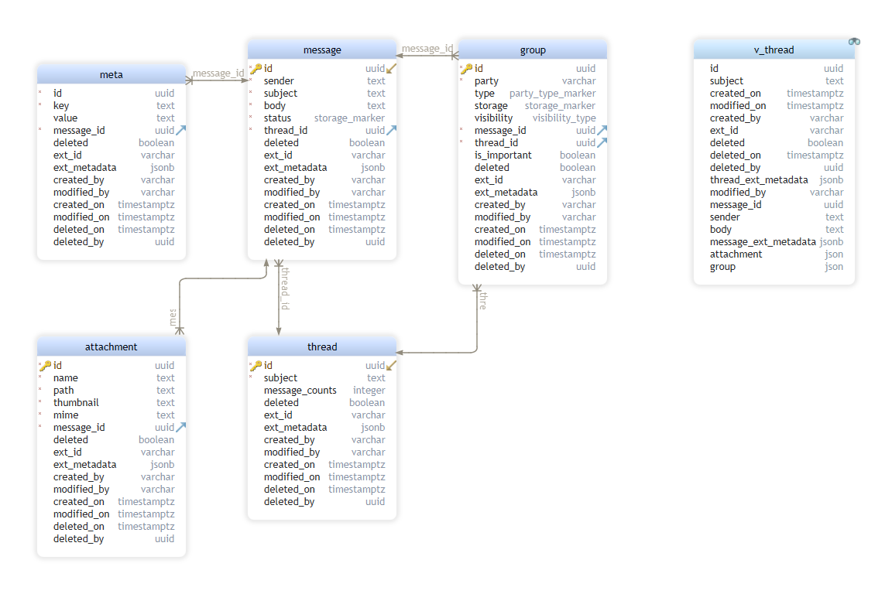

# in-mail-service

[-@2x.png)](http://loopback.io/)

A Loopback Microservice primarily used for in-mail implementation to compose and view in-mails for
any client application.

## Installation

```bash
   npm i @sourceloop/in-mail-service
```

## Usage

 - Create a new Loopback4 Application (If you don't have one already)
  `lb4 testapp`
- Install the in mail service
`npm i @sourceloop/in-mail-service`
- Set the [environment variables](#environment-variables).
- Run the [migrations](#migrations).
- Add the `InMailServiceComponent` to your Loopback4 Application (in `application.ts`).
	``` typescript
  // import the InMailServiceComponent
  import { InMailServiceComponent } from '@sourceloop/in-mail-service';
	// add Component for InMailServiceComponent
	this.component(InMailServiceComponent);
	```
- Set up a [Loopback4 Datasource](https://loopback.io/doc/en/lb4/DataSource.html) with `dataSourceName` property set to `InMailDatasourceName`. You can see an example datasource [here](#setting-up-a-datasource).
- Start the application
  `npm start`


### Setting up a `DataSource`

Here is a sample Implementation `DataSource` implementation using environment variables and PostgreSQL as the data source.

```typescript
import {inject, lifeCycleObserver, LifeCycleObserver} from '@loopback/core';
import {juggler} from '@loopback/repository';
import {InMailDatasourceName} from '@sourceloop/in-mail-service';

const config = {
  name: InMailDatasourceName,
  connector: 'postgresql',
  host: process.env.DB_HOST,
  port: process.env.DB_PORT,
  user: process.env.DB_USER,
  password: process.env.DB_PASSWORD,
  database: process.env.DB_DATABASE,
  schema: process.env.DB_SCHEMA,
};

@lifeCycleObserver('datasource')
export class InmailDataSource
  extends juggler.DataSource
  implements LifeCycleObserver {
  static dataSourceName = InMailDatasourceName;
  static readonly defaultConfig = config;

  constructor(
    @inject(`datasources.config.${SchedulerDatasourceName}`, {optional: true})
    dsConfig: object = config,
  ) {
    super(dsConfig);
  }
}
```

### Migration

The migrations required for this service are processed during the installation automatically if you set the `INMAIL_MIGRATION` or `SOURCELOOP_MIGRATION` env variable. The migrations use [`db-migrate`](https://www.npmjs.com/package/db-migrate) with [`db-migrate-pg`](https://www.npmjs.com/package/db-migrate-pg) driver for migrations, so you will have to install these packages to use auto-migration. Please note that if you are using some pre-existing migrations or database, they may be effected. In such scenario, it is advised that you copy the migration files in your project root, using the `INMAIL_MIGRATION_COPY` or `SOURCELOOP_MIGRATION_COPY` env variables. You can customize or cherry-pick the migrations in the copied files according to your specific requirements and then apply them to the DB.

#### Database Model



### Setting Environment Variables

Do not forget to set Environment variables. The examples below show a common configuration for a PostgreSQL Database running locally.
```environment
NODE_ENV=dev
LOG_LEVEL=DEBUG
HOST=0.0.0.0
PORT=3000
DB_HOST=localhost
DB_PORT=5432
DB_USER=pg_service_user
DB_PASSWORD=pg_service_user_password
DB_DATABASE=in_mail_db
DB_SCHEMA=public
JWT_SECRET=super_secret_string
JWT_ISSUER=https://authentication.service
```


| Name          | Required | Default Value | Description                                                  |
| ------------- | -------- | ------------- | ------------------------------------------------------------ |
| `NODE_ENV`    | Y        |               | Node environment value, i.e. `dev`, `test`, `prod`           |
| `LOG_LEVEL`   | Y        |               | Log level value, i.e. `error`, `warn`, `info`, `verbose`, `debug` |
| `HOST`        | Y        |               | Host for the service to run under, i.e. `0.0.0.0`            |
| `PORT`        | Y        | `3000`        | Port for the service to listen on.                           |
| `DB_HOST`     | Y        |               | Hostname for the database server.                            |
| `DB_PORT`     | Y        |               | Port for the database server.                                |
| `DB_USER`     | Y        |               | User for the database.                                       |
| `DB_PASSWORD` | Y        |               | Password for the database user.                              |
| `DB_DATABASE` | Y        |               | Database to connect to on the database server.               |
| `DB_SCHEMA`   | Y        | `public`      | Database schema used for the data source. In PostgreSQL, this will be `public` unless a schema is made explicitly for the service. |
| `JWT_SECRET`  | Y        |               | Symmetric signing key of the JWT token.                      |
| `JWT_ISSUER`  | Y        |               | Issuer of the JWT token.                                     |


### API Documentation

#### Common Headers

Authorization: Bearer <token> where <token> is a JWT token signed using JWT issuer and secret.
`Content-Type: application/json` in the response and in request if the API method is NOT GET

#### Common Request path Parameters

{version}: Defines the API Version

### Common Responses

200: Successful Response. Response body varies w.r.t API
401: Unauthorized: The JWT token is missing or invalid
403: Forbidden : Not allowed to execute the concerned API
404: Entity Not Found
400: Bad Request (Error message varies w.r.t API)
201: No content: Empty Response

#### API Details

##### POST /mails

**Description:** Compose or draft a Mail to various Recipients

**Request Body:**
```javascript
{
  "threadId": "string", // Optional, add if you want the messages in a same thread
  "groups": [ // You can define one or more receipients in a group array.
    {
      "party": "string", // email of the recipient
      "type": "to", // type can be to | cc | bcc
    }
  ],
  "attachments": [ // Optional
    {
      "name": "string", // name of the attachment file
      "path": "string", // It can be url like s3 url
      "thumbnail": "string", // Smaller/Compressed version of attachment path. can be s3 url
      "mime": "string", // Content Type of a file (example: image/jpg)
    }
  ],
  "meta": [ // Optional
    {
      "key": "string", // Key Name like Content-Type
      "value": "string", // Value like application/json, text/html etc.
    }
  ],
  "body": "string", // The Message Body
  "subject": "string", // The title  of the Message
  "status": "string", // Draft if you don't want to send message Now
  "extId": "string", // External Id from the Client (Optional)
  "extMetadata": {} // External Metadata from the Client (Optional)
}
```
**Successful Response:**
```javascript
{
  "id": "string", // id of the message
  "version": "string" // API vewrsion
}
```
##### PUT /mails/{messageId}

**Description:** Update Drafted Messages such as modifying attachment, receipients, message body, subject etc.

**Request path Parameters:**

{messageId}: Unique Id of the message which needs to be updated

**Request Body:**
```javascript
{
  "groups": [ // You can define one or more receipients in a group array.
    {
      "party": "string", // email of the recipient
      "type": "to", // type can be to | cc | bcc
    }
  ],
  "attachments": [ // Optional
    {
      "name": "string", // name of the attachment file
      "path": "string", // It can be url like s3 url
      "thumbnail": "string", // Smaller/Compressed version of attachment path. can be s3 url
      "mime": "string", // Content Type of a file (example: image/jpg)
    }
  ],
  "meta": [ // Optional
    {
      "key": "string", // Key Name like Content-Type
      "value": "string", // Value like application/json, text/html etc.
    }
  ],
  "body": "string", // The Message Body (Optional)
  "subject": "string", // The title  of the Message (Optional)
  "status": "string", // Draft if you don't want to send message Now, otherwise, send
  "extId": "string", // External Id from the Client (Optional)
  "extMetadata": "object" // External Metadata from the Client (Optional)
}
```
Success Response:
```javascript
{
  "id": "string", // id of the message
  "version": "string" // API vewrsion
}
```

##### POST /mails/{messageId}/attachments

**Description:** add an attachment to an existing drafted mail

**Request path Parameters:**

{messageId}: The unique id of a mail

**Request Body:**
```javascript
{
  "attachments": [
    {
      "name": "string", // name of the attachment file
      "path": "string", // It can be url like s3 url
      "thumbnail": "string", // Smaller/Compressed version of attachment path. can be s3 url
      "mime": "string" // Content Type of a file (example: image/jpg)
    }
  ]
}
```

**Successful Response:**
```javascript
{
  "items": "array", // array containing attachments,
  "version": "string", // an API version
}
```
##### DELETE /mails/bulk/{storage}/{action}

**Description:** Move inbox/sent items to trash or delete the trashed item

**Request path parameters:**

{storage}: inbox/send/trash (to trash the inbox/sent message or to delete the trashed message)

{action}: trash/delete

**Request body parameters**

```javascript
{
  "messageIds": "Array<string>"
}
```

**Successful Response:**
```javascript
{
  "version" : "string", // the API version
  "item": "Array<object>" // recipient/sender details which was marked for deletion/trash
}
```

##### PATCH /mails/bulk/restore

**Description:** Restore the trashed Mail

**Request body parameters**

```javascript
{
  "messageIds": "Array<string>"
}
```

**Successful Response:**
```javascript
{
  "version": "string", // the API version
  "items": "Array<object>" // receipient/sender details which was restored from trash
}
```

##### PATCH /mails/{messageId}/forward

**Description:** Forward the mail to another receipient

**Request path Parameter:**

{messageId}: Unique message Id

**Request Body:**
```javascript
{
  "groups": [ // you can specify more recipients in groups array for forwarding the mail to multiple recipients
    {
      "party": "string", // email of the recipient
      "type": "to" | "bcc" | "cc", // receipient type
    }
  ]
}
```
**Successful Response:**
```javascript
{
  "version": "string", // the API version
  "id": "string" // the message Id
}
```

##### PATCH /mails/{messageId}/send

**Description:** Send the drafted mail to the receipent

**Request path Parameter:**

{messageId}: Unique Message Id

Successful response
```javascript
{
  "id": "string",
  "version": "string"
}
```

##### PATCH /mails/marking/{markType}

**Description:** mark the mails as read/unread/important/not-important

**Request path Parameter:**

{markType}: read/unread/important/not-important

Successful response
```javascript
{
  success : true,
}
```


##### GET /threads/{threadId}

**Request path Parameters:**

{threadId}: Unique id of thread

**Request query Parameter(Optional):**

filter: Object which contains attribute(s) key value pairs of thread model which is used to filter data.

**Successful Response:**
```javascript
{
  "version": "string", // the API version
  "item": "object" // item containg the thread and the related message, attachment and/or meta-data details
}
```

##### GET /threads

**Request query parameter(s):**

groupFilter: Object which contains attribute(s) key value pairs of group model which is used to filter items.
threadFilter: Object which contains attribute(s) key value pairs of thread model which is used to filter items.

**Successful Response:**
```javascript
{
   "version": "string", // the API version
   "items": "array"  // array containing thread details and the corresponding messages, attachments etc.
}
```

##### GET /mails

**Request query parameter(s):**

groupFilter: Object which contains attribute(s) key value pairs of group model which is used to filter items.
threadFilter: Object which contains attribute(s) key value pairs of thread model which is used to filter items.

## API's Details

Visit the [OpenAPI spec docs](./openapi.md)